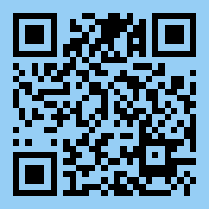
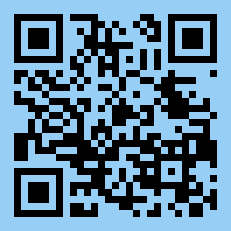

# BTC

Address: `bc1qs54zvmp9xdwlqe3f0dd8xskrmf9pzc3f5l9uyt`

Scan it with your crypto wallet:

# Ethereum

Address: `0xc487365bAF5CB7fD4987EdcB5cB445fa027e755a`

Scan it with your crypto wallet:

# BNB Smart Chain

Address: `0xc487365bAF5CB7fD4987EdcB5cB445fa027e755a`

Scan it with your crypto wallet:

# Solana

Address: `C3ZnqmnQZPiKYvb1EYvHkNNZgfPj3JNHntiTznwNjV5W`

Scan it with your crypto wallet:

# TON

Address: `EQA6KLiYUMyJA1p5cQpMklwmmkRFlRMtgoMe8R3_sUUhwCnG`

Scan it with your crypto wallet:

# Tron

Address: `TSHtcxgHEuPYSgYM2WkK8JVLZDsvhPvwbv`

Scan it with your crypto wallet:

